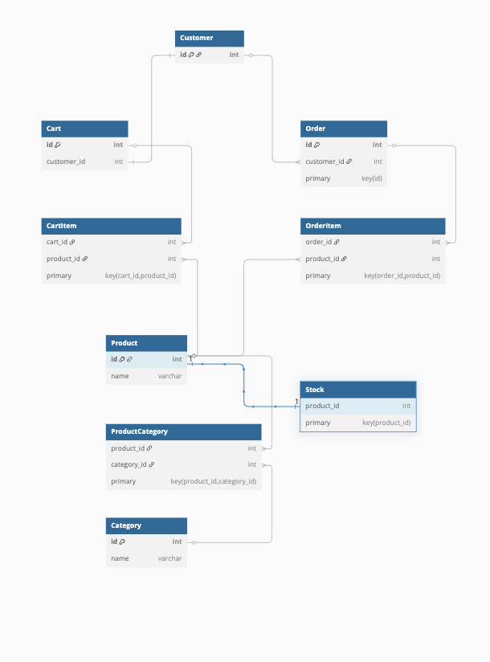

## 기술 스택

- gradle 8.x
- kotlin 1.9.x
- spring boot 3.4.x
- jpa(with `spring data jpa`)
- jUnit 5
- infrastructure
    - mysql 8.x

## project 구성

이 프로젝트는 이커머스 시스템을 DDD(Domain-Driven Design) 도메인 모델링한 예제입니다.

논리적으로는 모듈을 `domain`, `app`, `infra`로 나누었지만,   
실제로는 물리적인 Gradle 서브모듈로 나누지 않고 단일 프로젝트 구조로 구성되어 있습니다.
- modules
    - `domain`: [도메인](./src/main/kotlin/com/dt/ecommerce/domain/README.md) 모듈
    - `app`: [APP](./src/main/kotlin/com/dt/ecommerce/app/README.md) 모듈
    - `infra`: [인프라](./src/main/kotlin/com/dt/ecommerce/infra/README.md) 모듈
  ```mermaid
  flowchart TB
    subgraph APP
      direction TB
      AO["Order"]
    end
    subgraph DOMAIN
      direction TB
      DO["Order"]
    end
    subgraph INFRASTRUCTURE
      direction TB
      IO["Order"]
    end
    APP --o DOMAIN & INFRASTRUCTURE
    INFRASTRUCTURE --o DOMAIN
  ```
  
## ERD

